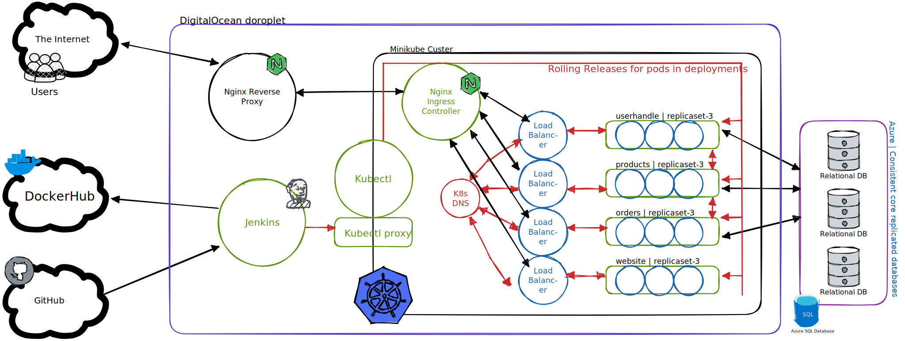

# cloudstore : A scalable microservice architechtured backed web store

Created as a project in a very short sprint, complying to common microservice architechtures. Fully functional, backend heavy implementation. 

> Note : To access this project and try it out for your self click here : [hackframe.navinxyz.com](https://hackframe.navinxyz.com)

## Architechture 

Here is a top level overview of cloudstores architechture : 

## Technologies used : 
- Minikube : 
To make our deloyment quick and easy, we resorted to using minikube cluster as our main deployment cluster. 
- Nginx reverse proxies and ingress controller : They do what they are supposed to do.
- All out backed services are written in `go` using `GORM` for database access and `gin` for api routers handling.
- Frontend is written in basic ract with redux state management
- We used a global azure replicated across zones database to avoid havin single point of faiulure in the minikube and make our deployments easy. 
- Uses Jenkins pipline to auto deploy changes to github. Setting this up required messing with user permission heavily in the server instance. 
- All of minikube and jenkins parts are hosted in DigitalOcean (8gb ram) droplet.

